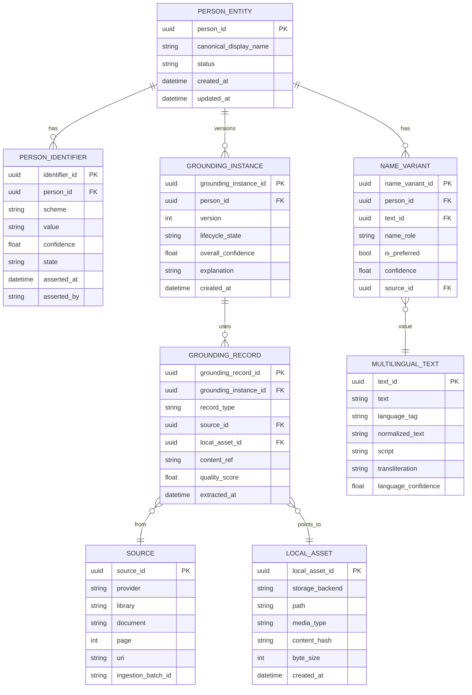

# Entity-Relationship Diagram

## Authority Identifier Notation

```mermaid
erDiagram
      PERSON_ENTITY ||--o{ PERSON_IDENTIFIER : has
      PERSON_ENTITY ||--o{ GROUNDING_INSTANCE : versions
      GROUNDING_INSTANCE ||--o{ GROUNDING_RECORD : uses
      GROUNDING_RECORD }o--|| SOURCE : from
      GROUNDING_RECORD }o--|| LOCAL_ASSET : points_to
      PERSON_ENTITY ||--o{ NAME_VARIANT : has
      NAME_VARIANT }o--|| MULTILINGUAL_TEXT : value

      PERSON_ENTITY {
         uuid person_id PK
         string canonical_display_name
         string status
         datetime created_at
         datetime updated_at
      }

      PERSON_IDENTIFIER {
         uuid identifier_id PK
         uuid person_id FK
         string scheme
         string value
         float confidence
         string state
         datetime asserted_at
         string asserted_by
      }

      GROUNDING_INSTANCE {
         uuid grounding_instance_id PK
         uuid person_id FK
         int version
         string lifecycle_state
         float overall_confidence
         string explanation
         datetime created_at
      }

      GROUNDING_RECORD {
         uuid grounding_record_id PK
         uuid grounding_instance_id FK
         string record_type
         uuid source_id FK
         uuid local_asset_id FK
         string content_ref
         float quality_score
         datetime extracted_at
      }

      SOURCE {
         uuid source_id PK
         string provider
         string library
         string document
         int page
         string uri
         string ingestion_batch_id
      }

      LOCAL_ASSET {
         uuid local_asset_id PK
         string storage_backend
         string path
         string media_type
         string content_hash
         int byte_size
         datetime created_at
      }

      MULTILINGUAL_TEXT {
         uuid text_id PK
         string text
         string language_tag
         string normalized_text
         string script
         string transliteration
         float language_confidence
      }

      NAME_VARIANT {
         uuid name_variant_id PK
         uuid person_id FK
         uuid text_id FK
         string name_role
         bool is_preferred
         float confidence
         uuid source_id FK
      }
```
